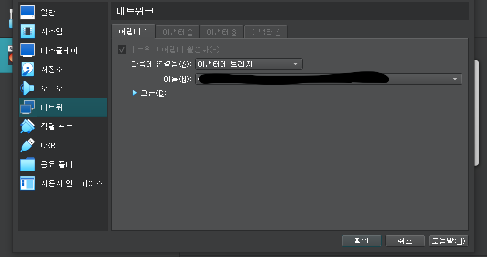

# __How to remote connect Rocky Linux 9 in Virtual Box via SSH?__


* 💻 Server PC = Samsung laptop + ( Virtual Box + Rocky Linux 9 ) 
* 🧑‍💻 My PC = MacBook 

## 1. Change Rocky Linux 9 network setting.

 * `Network` -> `Bridged Adapter`



__Then why we have to set `Bridged Adapter`?__

For the first time, i was setting `NAT` option for `Network Adapter` Tab. 
`NAT` option is only able to connect with internal network. 
But `Bridged Adapter` can networking other machines even if that is on other network.
In the other hand, `NAT` is working on local only.

## 2. Static IP address
* [Click if you use Rocky Linux 9 Server](https://www.youtube.com/watch?v=qwUEXjpUklY)

* [Click if you use Rocky Linux 9 GUI](https://ciq.com/blog/how-to-set-a-static-ip-address-in-rocky-linux-using-the-gui/)

## 3. Setting SSH on Rocky Linux 9 


* install ssh
    
    `sudo yum install openssh-server`

* run ssh demon 
    
    `sudo systemctl start sshd`

* active ssh demon
    
    `sudo systemctl enable sshd`

* open `sshd_config` via vi editor

    `sudo vi /etc/ssh/sshd_config`
* edit `sshd_config` file
    ```
    LoginGraceTime 1m
    MaxAuthTries 5
    MaxSessions 5
    AllowUsers *@🧑‍💻MyPC IP address
    PermitRootLogin no 
    ```
* restart ssh

    `sudo systemctl restart sshd`
    

## 4. Connect SSH with '🧑‍💻My PC' to 'Samsung laptop (Rocky Linux 9)'
 * open Terminal and remote connection SSH
  `ssh -p PortNumber username@RockyLinux9 IP address`

## 5. MariaDB installation via SSH
`sudo dnf install mariadb-server`

`sudo systemctl start mariadb`

`sudo systemctl enable mariadb`

`sudo mysql_secure_installation`

## 6. Login Mariadb via SSH
    
`sudo mariadb -u root -p`

